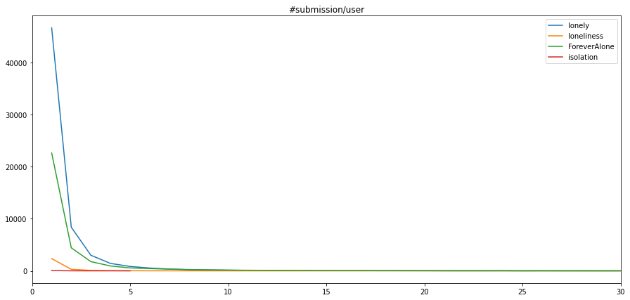
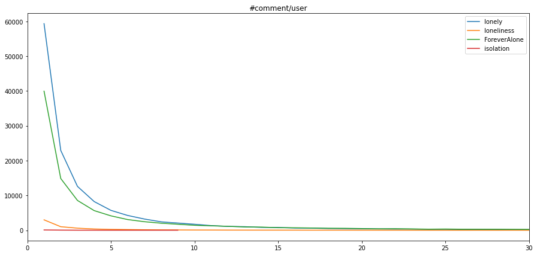

# Subreddit Statistics

[Dashboard](https://akaicc1127.shinyapps.io/social-loneliness-reddit/)

- STM 20
- LIWC scores

## Data

- Terms:
  - submission: the initial post of a thread
  - comment: the replies after a submission
- Data statistics:

| Subreddit      | #submissions (non-empty) | #comments (non-empty) | Created Date | #members |
| :------------- | ------------------------ | --------------------- | ------------ | -------- |
| r/lonely       | 110937                   | 738710                | 7/3/2008     | 237k     |
| r/ForeverAlone | 97254                    | 2054757               | 9/15/2010    | 162k     |
| r/loneliness   | 3964                     | 21909                 | 3/16/2010    | 9.5k     |
| r/isolation    | 74                       | 187                   | 6/17/2010    | 335      |

- Available fields: 

  - submission: 

    | Parameter             | Description                                  | Default      | Accepted Values                                            |
    | --------------------- | -------------------------------------------- | ------------ | ---------------------------------------------------------- |
    | subreddit             | Restrict to a specific subreddit             | N/A          | String or comma-delimited string (Multiple values allowed) |
    | created_utc           |                                              |              |                                                            |
    | ids                   | Get specific comments via their ids          | N/A          | Comma-delimited base36 ids                                 |
    | title                 |                                              |              |                                                            |
    | author                | Restrict to a specific author                | N/A          | String or comma-delimited string (Multiple values allowed) |
    | author_fullname       |                                              |              |                                                            |
    | num_comments          | Restrict results based on number of comments | N/A          | Integer or > x or < x (i.e. num_comments=>100)             |
    | upvote_ratio          |                                              |              |                                                            |
    | num_crossposts        |                                              |              |                                                            |
    | total_awards_received |                                              |              |                                                            |
    | over_18               | Restrict to nsfw or sfw content              | both allowed | "true" or "false"                                          |
    | selftext              | Searches the selftext field only             | N/A          | String / Quoted String for phrases                         |
    | domain                |                                              |              |                                                            |
    | full_link             |                                              |              |                                                            |
    | permalink             |                                              |              |                                                            |

  - comment:

    ```
    'subreddit', 'created_utc', 'id', 'link_id', 'parent_id', 'author','author_fullname', 'body', 'collapsed', 'is_submitter', 'no_follow','permalink'
    ```

- File size: ~1.2GB

## Post statistics

### #submission, #comments by year


## #submission, #comments by month (2019-2021)

- submission trend


- comment trend


### #comments/submission by subreddit


## User engagement statistics

### #submission & #comments per user



